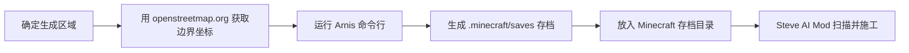
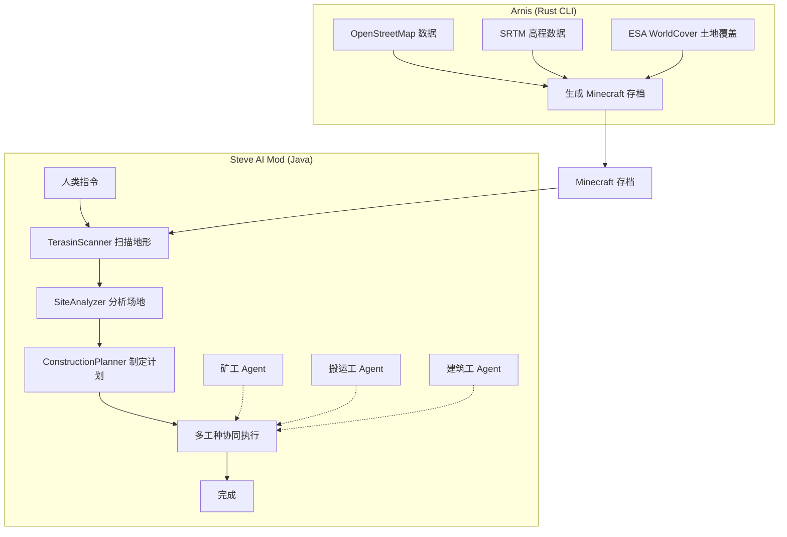
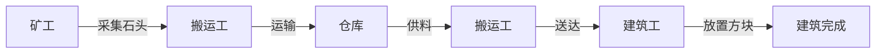
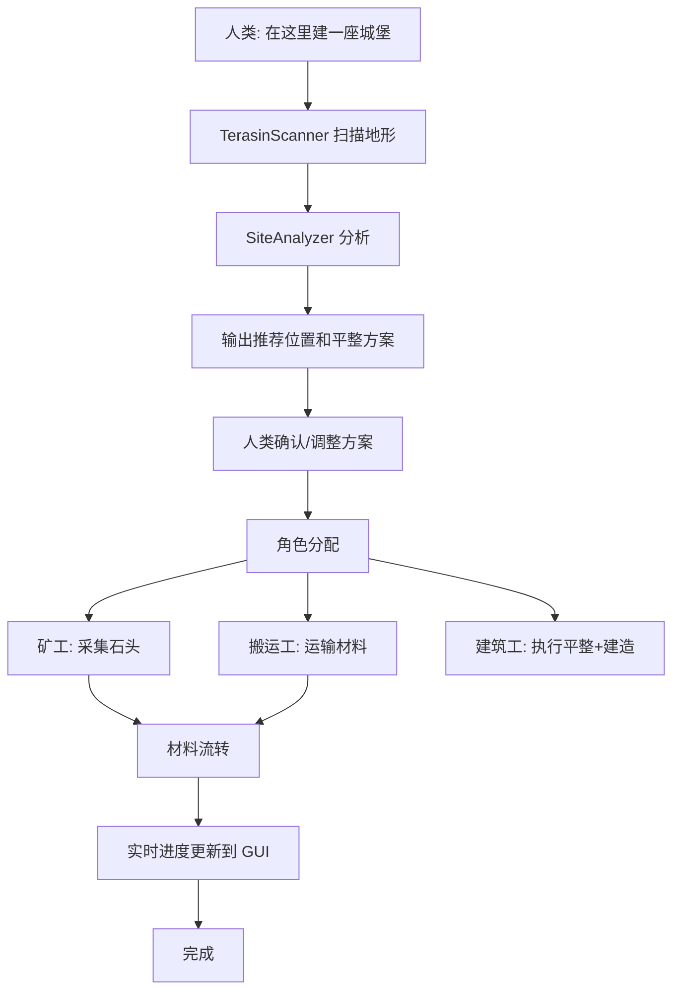

# 施工无人工地 - 设计文档

## 1. 项目概述

### 1.1 背景

利用 Minecraft 作为仿真环境，实现一个人机协作的多工种施工系统。

### 1.2 技术栈

| 组件 | 技术 | 用途 |
|------|------|------|
| 地形生成 | [Arnis](https://github.com/louis-e/arnis) (Rust) | 从现实世界生成高真实度 Minecraft 存档 |
| 施工执行 | Steve AI Mod (Java) | AI Agent 执行建造任务 |
| 人机交互 | 自然语言 + GUI | 人类指挥和监督施工 |

### 1.3 Arnis 地形生成

Arnis 是 Rust 编写的命令行工具，可从 OpenStreetMap 和高程数据生成真实世界的 Minecraft Java/Bedrock 地图。

#### 命令行用法

```bash
# 预编译版本 (arnis-windows.exe)
arnis-windows.exe --terrain --path="C:/Users/LuZhong/.minecraft/saves/ConstructionSite" --bbox="39.9000,116.3800,39.9200,116.4200"

# 或用 cargo 编译运行
cargo run --no-default-features -- --terrain --path="存档目录" --bbox="min_lat,min_lng,max_lat,max_lng"
```

#### 关键参数

| 参数 | 说明 | 默认值 |
|------|------|--------|
| `--bbox` | 边界框 (min_lat,min_lng,max_lat,max_lng)，必填 | - |
| `--path` | Minecraft 存档输出目录，Java 版必填 | - |
| `--scale` | 方块/米比例 | 1.0 |
| `--ground_level` | 地面高度基准 | -62 |
| `--terrain` | 启用地形生成 | false |
| `--interior` | 生成建筑内部 | true |
| `--roof` | 生成屋顶 | true |
| `--land-cover` | 启用土地覆盖分类（森林/沙漠等） | true |
| `--bedrock` | 生成 Bedrock 版世界 | false |

#### 典型工作流



### 1.4 系统架构



## 2. 多工种 Agent 系统

### 2.1 AgentRole 枚举

```java
public enum AgentRole {
    MINER,      // 矿工：采矿、采集原料
    CARRIER,   // 搬运工：运输材料、供料
    BUILDER    // 建筑工：执行建造、放置方块
}
```

### 2.2 角色能力

| 角色 | 主要动作 | 目标 |
|------|---------|------|
| MINER | MineBlockAction | 采集矿石、石头 |
| CARRIER | TransportMaterialAction | 从矿工收集，送到仓库 |
| BUILDER | BuildStructureAction | 执行建造 |

### 2.3 角色分配

```bash
# 手动分配
/steve assign miner1 MINER
/steve assign carrier1 CARRIER
/steve assign builder1 BUILDER

# 自动分配（执行建造指令时）
/steve tell builder1 在这建城堡
→ 系统自动分配矿工和搬运工
```

## 3. 材料供应链

### 3.1 MaterialWarehouse

中央材料仓库。

```java
public class MaterialWarehouse {
    BlockPos location;                     // 仓库位置
    Map<Block, Integer> inventory;        // 材料库存

    void deposit(Block block, int count);
    int withdraw(Block block, int count);
    boolean has(Block block, int count);
}
```

### 3.2 材料流转



## 4. 施工流程

### 4.1 完整流程



## 5. 新增命令

| 命令 | 功能 |
|------|------|
| `/steve scan [radius]` | 扫描地形并分析 |
| `/steve assign <name> <role>` | 分配角色 (MINER/CARRIER/BUILDER) |
| `/steve warehouse` | 查看仓库库存 |
| `/steve status` | 查看施工状态 |
| `/steve plan <type> [position]` | 基于地形制定建造计划 |

## 6. 新增文件

| 文件路径 | 用途 |
|---------|------|
| `inventory/MaterialWarehouse.java` | 材料仓库 |
| `inventory/WarehouseManager.java` | 全局仓库管理 |
| `AgentRole.java` | 角色枚举 |
| `ConstructionPlanner.java` | 施工规划器 |
| `actions/TransportMaterialAction.java` | 运输动作 |

## 7. 修改文件

| 文件路径 | 修改内容 |
|---------|---------|
| `SteveEntity.java` | 添加 `AgentRole role` 属性 |
| `SteveConfig.java` | 添加施工相关配置 |
| `SteveCommands.java` | 添加新命令 |
| `SteveGUI.java` | 添加施工进度面板 |

## 8. 验证计划

### 8.1 Arnis 地形生成

1. **选择地点** — 在 [openstreetmap.org/export](https://www.openstreetmap.org/export) 选取区域，记录边界坐标
2. **生成存档** — 运行 Arnis 命令：
   ```bash
   arnis-windows.exe --terrain --path="C:/Users/LuZhong/AppData/Roaming/.minecraft/saves/ConstructionSite" --bbox="39.9000,116.3800,39.9200,116.4200"
   ```
3. **加载世界** — 将生成的存档放入 Minecraft `saves` 目录，用 Minecraft 打开

### 8.2 Steve AI 施工测试

4. `/steve scan 32` — 测试地形扫描
5. `/steve assign miner1 MINER` — 测试角色分配
6. `/steve tell miner1 采集 20 石头` — 测试采矿
7. `/steve tell builder1 在这建城堡` — 测试完整施工流程
8. 观察 GUI 中施工进度实时更新
