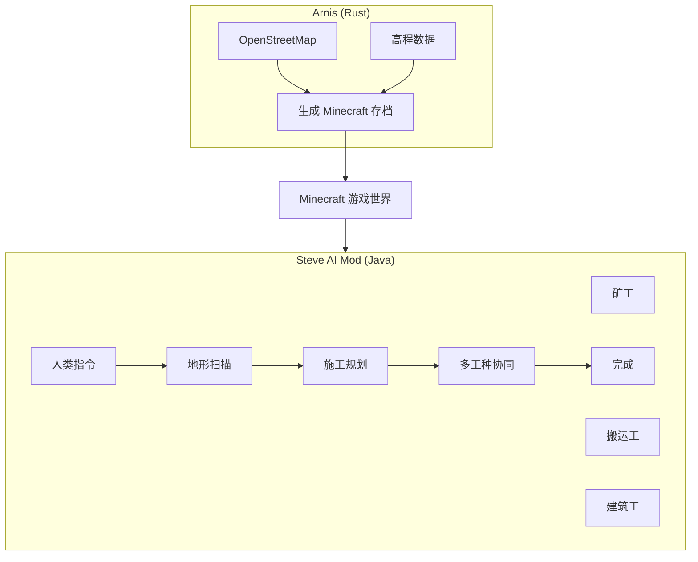
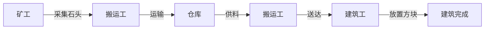
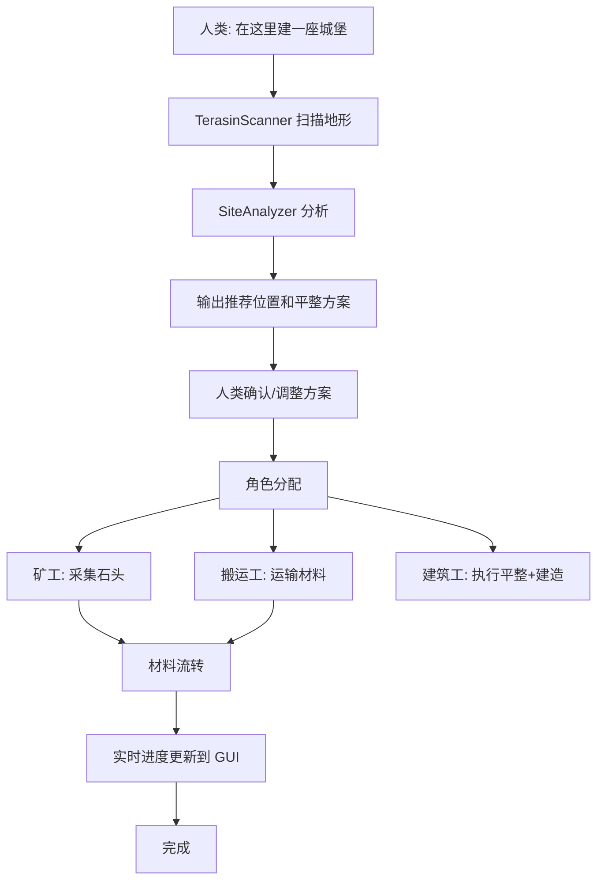

# 施工无人工地 - 设计文档

## 1. 项目概述

### 1.1 背景

利用 Minecraft 作为仿真环境，实现一个人机协作的多工种施工系统。

### 1.2 技术栈

| 组件 | 技术 | 用途 |
|------|------|------|
| 地形生成 | [Arnis](https://github.com/louis-e/arnis) | 从现实世界生成高真实度地形 |
| 施工执行 | Steve AI Mod | AI Agent 执行建造任务 |
| 人机交互 | 自然语言 + GUI | 人类指挥和监督施工 |

### 1.3 系统架构



## 2. 地形建模系统

### 2.1 TerrainScanner

扫描地形并生成高度图。

```java
public class TerrainScanner {
    // 扫描指定半径，生成高度图
    TerrainModel scan(BlockPos center, int radius);

    // 识别平坦可建筑区域
    List<FlatRegion> findFlatAreas(TerrainModel model);

    // 分类地面材质
    Map<BlockPos, Block> classifyGround(TerrainModel model);
}
```

### 2.2 TerrainModel

地形数据模型。

```java
public class TerrainModel {
    BlockPos origin;                        // 扫描原点
    int width, depth;                      // 扫描范围
    Map<BlockPos, Integer> heightMap;      // y 值
    Map<BlockPos, Block> groundTypes;      // 地面材质
    List<FlatRegion> flatAreas;            // 平坦区域
    List<BlockPos> obstacles;               // 障碍物
}

public class FlatRegion {
    BlockPos origin;                       // 左下角
    int width, depth;                      // 尺寸
    int avgHeight;                         // 平均高度
    double flatness;                       // 平整度 (0-1)
}
```

### 2.3 SiteAnalyzer

分析 TerrainModel，输出建筑建议。

```java
public class SiteAnalysis {
    BlockPos recommendedPos;               // 推荐位置
    List<BlockPlacement> levelingPlan;      // 平整方案
    Map<Block, Integer> materialsNeeded;  // 所需材料
    double suitabilityScore;               // 适合度评分
}

// 分析并输出推荐方案
SiteAnalysis analyze(TerrainModel model, String structureType);
```

## 3. 多工种 Agent 系统

### 3.1 AgentRole 枚举

```java
public enum AgentRole {
    MINER,      // 矿工：采矿、采集原料
    CARRIER,   // 搬运工：运输材料、供料
    BUILDER    // 建筑工：执行建造、放置方块
}
```

### 3.2 角色能力

| 角色 | 主要动作 | 目标 |
|------|---------|------|
| MINER | MineBlockAction | 采集矿石、石头 |
| CARRIER | TransportMaterialAction | 从矿工收集，送到仓库 |
| BUILDER | BuildStructureAction | 执行建造 |

### 3.3 角色分配

```bash
# 手动分配
/steve assign miner1 MINER
/steve assign carrier1 CARRIER
/steve assign builder1 BUILDER

# 自动分配（执行建造指令时）
/steve tell builder1 在这建城堡
→ 系统自动分配矿工和搬运工
```

## 4. 材料供应链

### 4.1 MaterialWarehouse

中央材料仓库。

```java
public class MaterialWarehouse {
    BlockPos location;                     // 仓库位置
    Map<Block, Integer> inventory;        // 材料库存

    void deposit(Block block, int count);
    int withdraw(Block block, int count);
    boolean has(Block block, int count);
}
```

### 4.2 材料流转



## 5. 施工流程

### 5.1 完整流程



## 6. 新增命令

| 命令 | 功能 |
|------|------|
| `/steve scan [radius]` | 扫描地形并分析 |
| `/steve assign <name> <role>` | 分配角色 (MINER/CARRIER/BUILDER) |
| `/steve warehouse` | 查看仓库库存 |
| `/steve status` | 查看施工状态 |
| `/steve plan <type> [position]` | 基于地形制定建造计划 |

## 7. 新增文件

| 文件路径 | 用途 |
|---------|------|
| `world/TerrainScanner.java` | 地形扫描器 |
| `world/TerrainModel.java` | 地形数据模型 |
| `world/SiteAnalyzer.java` | 场地分析器 |
| `inventory/MaterialWarehouse.java` | 材料仓库 |
| `inventory/WarehouseManager.java` | 全局仓库管理 |
| `AgentRole.java` | 角色枚举 |
| `ConstructionPlanner.java` | 施工规划器 |
| `actions/TransportMaterialAction.java` | 运输动作 |

## 8. 修改文件

| 文件路径 | 修改内容 |
|---------|---------|
| `SteveEntity.java` | 添加 `AgentRole role` 属性 |
| `SteveConfig.java` | 添加施工相关配置 |
| `SteveCommands.java` | 添加新命令 |
| `SteveGUI.java` | 添加施工进度面板 |

## 9. 验证计划

1. 用 Arnis 生成测试区域（选择一个熟悉的地点）
2. 放入 Minecraft 存档目录
3. `/steve scan 32` - 测试地形扫描
4. `/steve assign miner1 MINER` - 测试角色分配
5. `/steve tell miner1 采集 20 石头` - 测试采矿
6. `/steve tell builder1 在这建城堡` - 测试完整施工流程
7. 观察 GUI 中施工进度实时更新
