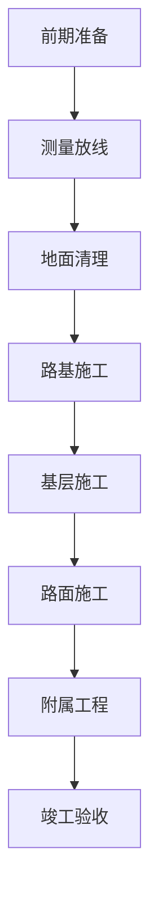
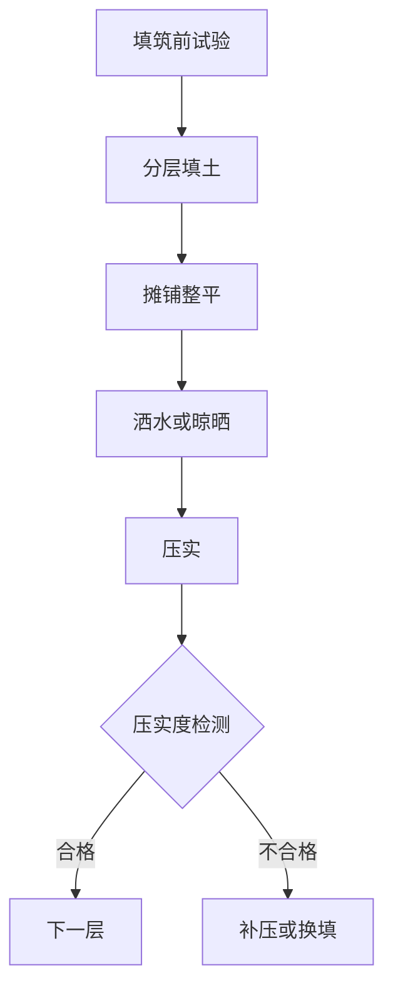
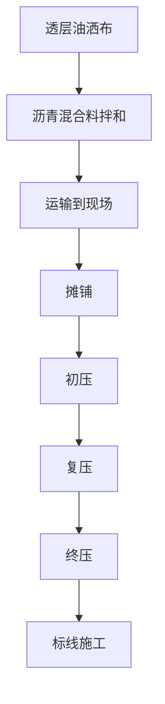

# 公路工程施工流程

## 1. 项目概述

公路施工是一个多阶段、多工种协同的线性工程。本文档描述从前期准备到竣工验收的完整流程。

## 2. 施工阶段总览



## 3. 各阶段详细流程

### 3.1 前期准备

| 工序 | 内容 | 产出 |
|------|------|------|
| 图纸会审 | 审查设计文件、施工图 | 审核记录 |
| 技术交底 | 向施工人员说明技术要求 | 交底记录 |
| 材料采购 | 沥青、碎石、水泥等 | 材料合格证 |
| 设备调配 | 摊铺机、压路机、装载机 | 设备就位 |

### 3.2 测量放线


**关键控制点：**
- 每 20m 一个中桩
- 每 10m 一个边桩
- 高程控制点间距不大于 100m

### 3.3 地面清理

| 工序 | 机械 | 验收标准 |
|------|------|---------|
| 清除表土 | 推土机、挖掘机 | 清除至原土层 |
| 拆除构筑物 | 破碎锤 | 基础完全拆除 |
| 清理草皮树根 | 割草机 | 无植被残留 |
| 场地平整 | 推土机、平地机 | 高程误差≤5cm |

### 3.4 路基施工

#### 3.4.1 路基填筑



**技术参数：**
- 分层厚度：30cm（压实后）
- 压实度要求：≥95%（高速公路）
- 含水量：最佳含水量 ±2%

#### 3.4.2 路基压实

| 压实阶段 | 机械 | 遍数 | 速度 |
|---------|------|------|------|
| 初压 | 钢轮压路机 | 2遍 | 1.5-2km/h |
| 复压 | 振动压路机 | 4-6遍 | 2-3km/h |
| 终压 | 胶轮压路机 | 2遍 | 3-5km/h |

### 3.5 基层施工

**常见基层类型：**

| 类型 | 厚度 | 适用场景 |
|------|------|---------|
| 级配碎石 | 15-30cm | 底基层 |
| 水泥稳定碎石 | 20-40cm | 基层 |
| 二灰结石 | 20-35cm | 基层 |

**施工流程：**
```
混合料拌和 → 运输 → 摊铺 → 整平 → 碾压 → 养护
```

### 3.6 路面施工

#### 3.6.1 沥青混凝土路面



**沥青混合料类型：**

| 结构层 | 材料 | 厚度 |
|-------|------|------|
| 上面层 | AC-13/SMA-13 | 4cm |
| 中面层 | AC-20 | 6cm |
| 下面层 | AC-25 | 8cm |

**温度控制：**

| 阶段 | 温度要求 |
|------|---------|
| 拌和温度 | 150-170°C |
| 摊铺温度 | ≥140°C |
| 初压温度 | 130-150°C |
| 复压温度 | 100-130°C |
| 终压温度 | ≥70°C |

#### 3.6.2 水泥混凝土路面

| 工序 | 内容 | 要点 |
|------|------|------|
| 模板安装 | 立模、调整高程 | 模板高程误差≤2mm |
| 钢筋绑扎 | 设置传力杆、拉杆 | 位置准确 |
| 混凝土浇筑 | 罐车运输、平仓 | 避免离析 |
| 振捣 | 插入式振捣器 | 防止漏振过振 |
| 收面 | 人工或抹光机 | 平整度≤3mm/3m |
| 养护 | 覆盖土工布洒水 | 养护期≥14天 |
| 切缝 | 缩缝切割 | 缝深1/3板厚 |

### 3.7 附属工程

| 工程 | 内容 |
|------|------|
| 排水工程 | 边沟、排水沟、涵洞 |
| 护坡工程 | 植草、浆砌片石 |
| 交通设施 | 护栏、标志牌、标线 |
| 绿化工程 | 边坡绿化、行道树 |

## 4. 质量检验

### 4.1 路基检验

| 项目 | 方法 | 频率 | 标准 |
|------|------|------|------|
| 压实度 | 灌砂法 | 每层1点/200m | ≥95% |
| 平整度 | 3m直尺 | 每100m 3点 | ≤20mm |
| 高程 | 水准仪 | 每20m 1点 | ±20mm |
| 宽度 | 卷尺 | 每20m 1点 | ≥设计值 |

### 4.2 路面检验

| 项目 | 方法 | 标准 |
|------|------|------|
| 压实度 | 钻芯取样 | ≥98% |
| 平整度 | 颠簸累积仪 IRI | ≤2.0m/km |
| 厚度 | 钻芯测量 | ≥设计值 |
| 摩擦系数 | 摆式仪 | ≥BPN45 |

## 5. 施工安全要点

1. **交通安全** — 施工路段设置交通疏导标志
2. **机械安全** — 禁止机械在同一作业面交叉运行
3. **用电安全** — 临时用电采用三级配电两级保护
4. **高温施工** — 沥青作业避开中午高温时段
5. **个人防护** — 佩戴安全帽、反光背心、防滑鞋

## 6. 工期估算

**典型高速公路每公里施工周期：**

| 阶段 | 工期 |
|------|------|
| 路基工程 | 15-20天 |
| 基层工程 | 10-15天 |
| 路面工程 | 12-18天 |
| 附属工程 | 10-15天 |
| **合计** | **47-68天** |
