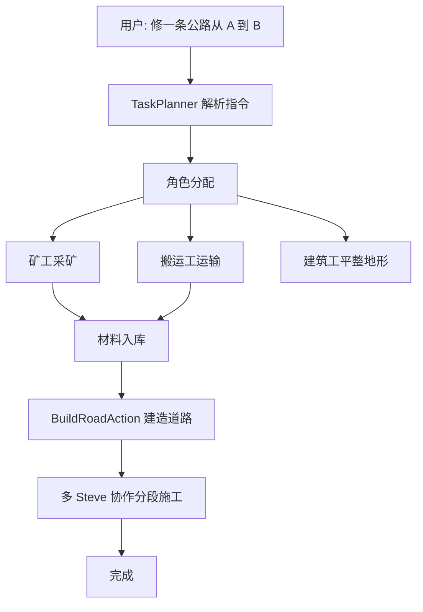

# 公路施工 - Minecraft 实现方案

## 1. 项目现状

### 1.1 已有能力

| 组件 | 实现 |
|------|------|
| BuildStructureAction | 按方块序列逐块放置，支持协作 |
| StructureGenerators | 8 种建筑类型 (house, castle, tower, wall, platform, barn, modern, box) |
| CollaborativeBuildManager | 4 象限空间分割协作 |
| AgentStateMachine | IDLE→PLANNING→EXECUTING→COMPLETED 状态机 |
| TaskPlanner | LLM 异步任务规划 |

### 1.2 缺失功能

| 功能 | 状态 |
|------|------|
| AgentRole 枚举 | 仅文档存在 |
| MaterialWarehouse | 仅文档存在 |
| TransportMaterialAction | 仅文档存在 |
| 线性结构生成器 | 无 |
| 地形平整逻辑 | 仅检测，无平整 |

## 2. 实现方案

### 2.1 新增文件

```
src/main/java/com/steve/ai/
├── entity/
│   └── AgentRole.java                    # 角色枚举
├── inventory/
│   ├── MaterialWarehouse.java            # 材料仓库
│   └── WarehouseManager.java             # 全局仓库管理
├── structure/
│   └── RoadStructureGenerator.java       # 道路生成器
└── action/actions/
    ├── TransportMaterialAction.java      # 材料运输
    ├── TerrainLevelingAction.java       # 地形平整
    └── BuildRoadAction.java             # 道路建造
```

### 2.2 修改文件

| 文件 | 修改内容 |
|------|---------|
| `SteveEntity.java` | 添加 `AgentRole role` 字段 |
| `StructureGenerators.java` | 添加 `road`/`highway` 类型 |
| `CoreActionsPlugin.java` | 注册 `road`、`transport`、`leveling` 动作 |
| `SteveCommands.java` | 添加 `/steve assign`、`/steve warehouse` 命令 |

## 3. 核心组件设计

### 3.1 AgentRole 枚举

```java
public enum AgentRole {
    MINER,      // 矿工：采矿、采集原料
    CARRIER,    // 搬运工：运输材料
    BUILDER,    // 建筑工：执行建造
    UNASSIGNED  // 默认：无角色
}
```

### 3.2 MaterialWarehouse

```java
public class MaterialWarehouse {
    BlockPos location;
    Map<Block, Integer> inventory;

    int deposit(Block block, int count);
    int withdraw(Block block, int count);
    boolean has(Block block, int count);
}
```

### 3.3 RoadStructureGenerator

道路分层结构：

```
┌─────────────────────────────────────┐
│           路面 (Surface)             │  ← 可配置 (默认 cobblestone)
├─────────────────────────────────────┤
│           基层 (Base)                │  ← cobblestone, 深 1 格
├─────────────────────────────────────┤
│         底基层 (Subbase)             │  ← gravel, 深 1 格
├─────────────────────────────────────┤
│         路基 (Subgrade)              │  ← dirt, 深 2 格
└─────────────────────────────────────┘
          ▼ 向下挖
```

**参数：**
- 道路宽度：5 格
- 每段长度：16 格
- 总深度：5 格

## 4. 施工流程



### 4.1 指令示例

```bash
# 简单指令
/steve tell builder1 修一条公路从 100,64,200 到 200,64,200

# 完整流程
/steve assign miner1 MINER
/steve assign carrier1 CARRIER
/steve assign builder1 BUILDER
/steve warehouse create main 100,64,195
/steve tell miner1 采集 500 圆石
/steve tell carrier1 运输 圆石 从 miner1 到 main 仓库
/steve tell builder1 在 100,64,200 到 200,64,200 之间修一条公路
```

## 5. 实施顺序

| Phase | 内容 | 文件 |
|-------|------|------|
| 1 | 基础设施 | AgentRole.java, MaterialWarehouse.java, WarehouseManager.java |
| 2 | 道路生成 | RoadStructureGenerator.java |
| 3 | 新动作 | TransportMaterialAction.java, TerrainLevelingAction.java, BuildRoadAction.java |
| 4 | 集成 | 修改 SteveEntity, CoreActionsPlugin, SteveCommands |
| 5 | 测试 | 验证各功能 |

## 6. 验证测试

```bash
# 1. 单 Agent 道路建造
/steve tell steve1 修一条公路从 100,64,200 到 116,64,200

# 2. 多 Agent 协作
/steve assign miner1 MINER
/steve assign builder1 BUILDER
/steve tell miner1 采集 200 圆石
/steve tell builder1 在 100,64,200 到 200,64,200 之间修一条公路

# 3. 检查日志
# 期望看到: "Road construction completed!"
```

## 7. 技术要点

### 7.1 分段施工

RoadStructureGenerator 将道路分成 16 格一段，每段独立建造，支持：
- 多 Steve 并行处理不同段
- 单 Steve 逐段建造

### 7.2 协作建造

BuildRoadAction 使用 CollaborativeBuildManager：
- 自动分配象限
- 多 Steve 同时放置不同方块
- 进度跟踪

### 7.3 材料供应链

```
矿工 → 材料入库 → 搬运工运输 → 仓库 → 建筑工取料 → 建造
```

MaterialWarehouse 作为中央存储，搬运工负责在各节点间运输。
